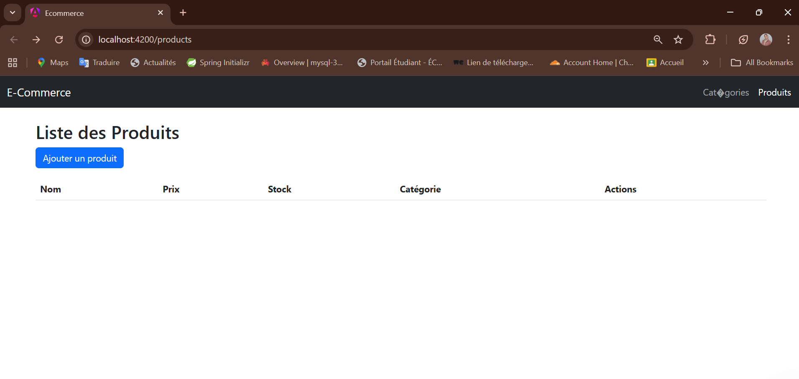

# Projet E-Commerce - TP 11
## Application de gestion de produits et catégories

---

## 📋 Description du projet

Application web complète permettant la gestion de produits et de catégories avec :
- **Backend** : API REST développée avec Spring Boot
- **Frontend** : Application Angular moderne avec interface utilisateur Bootstrap
- **Base de données** : MySQL pour la persistance des données

---

## 🎯 Fonctionnalités

### Gestion des Catégories
- ✅ Afficher la liste de toutes les catégories
- ✅ Ajouter une nouvelle catégorie (nom + description)
- ✅ Modifier une catégorie existante
- ✅ Supprimer une catégorie (avec confirmation)
- ✅ Validation : le nom est obligatoire

### Gestion des Produits
- ✅ Afficher la liste de tous les produits
- ✅ Ajouter un nouveau produit (nom, prix, stock, catégorie)
- ✅ Modifier un produit existant
- ✅ Supprimer un produit (avec confirmation)
- ✅ Filtrer les produits par catégorie
- ✅ Affichage du prix en MAD (Dirhams marocains)
- ✅ Liste déroulante pour sélectionner la catégorie

---

## � Captures d'écran

### Interface de gestion des produits

#### Liste des Produits


L'interface présente un tableau avec les colonnes : Nom, Prix, Stock, Catégorie et Actions. Le bouton "Ajouter un produit" permet d'accéder au formulaire de création.

#### Formulaire d'ajout de produit


Le formulaire permet de saisir :
- **Nom** : Nom du produit (obligatoire)
- **Prix** : Prix en dirhams marocains (obligatoire)
- **Stock** : Quantité disponible (obligatoire)
- **Catégorie** : Sélection depuis une liste déroulante (obligatoire)

Deux boutons sont disponibles : "Enregistrer" pour valider et "Annuler" pour revenir à la liste.

### Navigation
L'application dispose d'un menu de navigation avec deux sections principales :
- **Catégories** : Gestion des catégories de produits
- **Produits** : Gestion des produits

---

## �🛠️ Technologies utilisées

### Backend (Spring Boot)
- **Java 17**
- **Spring Boot 3.2.1**
- **Spring Web** - API REST
- **Spring Data JPA** - Accès aux données
- **MySQL** - Base de données relationnelle
- **Lombok** - Réduction du code boilerplate
- **Maven** - Gestion des dépendances

### Frontend (Angular)
- **Angular 18+** (Standalone Components)
- **TypeScript**
- **RxJS** - Programmation réactive
- **Bootstrap 5** - Interface utilisateur
- **HttpClient** - Communication avec l'API

---

## 📁 Structure du projet

```
TP 11/
├── ecommerce-backend/          # Backend Spring Boot
│   ├── src/
│   │   ├── main/
│   │   │   ├── java/com/emsi/ecommerce_backend/
│   │   │   │   ├── entities/            # Entités JPA
│   │   │   │   │   ├── CategoryEntity.java
│   │   │   │   │   └── ProductEntity.java
│   │   │   │   ├── repositories/        # Accès données
│   │   │   │   │   ├── CategoryRepository.java
│   │   │   │   │   └── ProductRepository.java
│   │   │   │   ├── Services/            # Logique métier
│   │   │   │   │   ├── CategoryService.java
│   │   │   │   │   └── ProductService.java
│   │   │   │   └── Controllers_REST/    # API REST
│   │   │   │       ├── CategoryController.java
│   │   │   │       └── ProductController.java
│   │   │   └── resources/
│   │   │       └── application.properties
│   │   └── test/
│   └── pom.xml
│
└── ecommerce/                   # Frontend Angular
    ├── src/
    │   ├── app/
    │   │   ├── models/              # Modèles TypeScript
    │   │   │   ├── category.model.ts
    │   │   │   └── product.model.ts
    │   │   ├── categories/          # Module catégories
    │   │   │   ├── category.service.ts
    │   │   │   ├── category-list/
    │   │   │   │   ├── category-list.component.ts
    │   │   │   │   └── category-list.component.html
    │   │   │   └── category-form/
    │   │   │       ├── category-form.component.ts
    │   │   │       └── category-form.component.html
    │   │   ├── products/            # Module produits
    │   │   │   ├── product.service.ts
    │   │   │   ├── product-list/
    │   │   │   │   ├── product-list.component.ts
    │   │   │   │   └── product-list.component.html
    │   │   │   └── product-form/
    │   │   │       ├── product-form.component.ts
    │   │   │       └── product-form.component.html
    │   │   └── app.routes.ts
    │   └── index.html
    ├── angular.json
    └── package.json
```

---

## 🔌 API REST Endpoints

### Catégories
| Méthode | URL | Description |
|---------|-----|-------------|
| GET | `/api/categories` | Liste toutes les catégories |
| GET | `/api/categories/{id}` | Récupère une catégorie par ID |
| POST | `/api/categories` | Crée une nouvelle catégorie |
| PUT | `/api/categories/{id}` | Modifie une catégorie existante |
| DELETE | `/api/categories/{id}` | Supprime une catégorie |

### Produits
| Méthode | URL | Description |
|---------|-----|-------------|
| GET | `/api/products` | Liste tous les produits |
| GET | `/api/products/{id}` | Récupère un produit par ID |
| GET | `/api/products/category/{id}` | Liste les produits d'une catégorie |
| POST | `/api/products` | Crée un nouveau produit |
| PUT | `/api/products/{id}` | Modifie un produit existant |
| DELETE | `/api/products/{id}` | Supprime un produit |

---

## 🚀 Installation et démarrage

### Prérequis
- **Java 17** installé
- **Node.js et npm** installés
- **MySQL** installé et démarré
- **Maven** (inclus via Maven Wrapper)

### 1. Configuration de la base de données

Démarrez MySQL et la base de données sera créée automatiquement au premier lancement du backend.

### 2. Démarrage du Backend

```powershell
cd "C:\Users\chaimae el kabil\Desktop\TP 11\ecommerce-backend"
.\mvnw.cmd clean spring-boot:run
```

Le backend démarre sur : **http://localhost:8081**

### 3. Démarrage du Frontend

Ouvrez un nouveau terminal :

```powershell
cd "C:\Users\chaimae el kabil\Desktop\TP 11\ecommerce"
npm install
ng serve
```

Le frontend démarre sur : **http://localhost:4200**

---

## 🔧 Configuration

### Backend - application.properties

```properties
spring.application.name=ecommerce-backend
server.port=8081

# Configuration MySQL
spring.datasource.url=jdbc:mysql://localhost:3306/ecommerce_db?createDatabaseIfNotExist=true
spring.datasource.username=root
spring.datasource.password=
spring.datasource.driver-class-name=com.mysql.cj.jdbc.Driver

# Configuration JPA/Hibernate
spring.jpa.hibernate.ddl-auto=update
spring.jpa.show-sql=true
spring.jpa.properties.hibernate.dialect=org.hibernate.dialect.MySQLDialect
```

### Frontend - Services

Les services Angular sont configurés pour communiquer avec le backend sur le port 8081 :
- CategoryService : `http://localhost:8081/api/categories`
- ProductService : `http://localhost:8081/api/products`

---

## 🗺️ Routes Angular

| Route | Composant | Description |
|-------|-----------|-------------|
| `/` | Redirection vers `/products` | Page d'accueil |
| `/categories` | CategoryListComponent | Liste des catégories |
| `/categories/add` | CategoryFormComponent | Ajout de catégorie |
| `/categories/edit/:id` | CategoryFormComponent | Modification de catégorie |
| `/products` | ProductListComponent | Liste des produits |
| `/products/add` | ProductFormComponent | Ajout de produit |
| `/products/edit/:id` | ProductFormComponent | Modification de produit |

---

## 📊 Modèle de données

### Entité Category
```java
@Entity
public class CategoryEntity {
    @Id @GeneratedValue
    private Long id;
    private String name;
    private String description;
    
    @OneToMany(mappedBy = "category")
    private List<ProductEntity> products;
}
```

### Entité Product
```java
@Entity
public class ProductEntity {
    @Id @GeneratedValue
    private Long id;
    private String name;
    private double price;
    private int stock;
    
    @ManyToOne
    @JoinColumn(name = "category_id")
    private CategoryEntity category;
}
```

---

## 🎨 Interface utilisateur

L'interface utilise Bootstrap 5 pour un design moderne et responsive :
- Tableaux stylisés pour l'affichage des listes
- Boutons colorés pour les actions (Ajouter, Modifier, Supprimer)
- Formulaires avec validation
- Messages de confirmation avant suppression

---

## 📝 Développement

### Ajout d'une nouvelle fonctionnalité

1. **Backend** :
   - Ajouter la méthode dans le Service
   - Exposer l'endpoint dans le Controller

2. **Frontend** :
   - Ajouter la méthode dans le Service Angular
   - Utiliser la méthode dans le Component
   - Mettre à jour le template HTML

---

## 🐛 Dépannage

### Problème : Port 8080 occupé
**Solution** : Le projet est configuré sur le port 8081. Si ce port est aussi occupé, modifiez `server.port` dans `application.properties`.

### Problème : Erreur de connexion MySQL
**Solution** : Vérifiez que MySQL est démarré et que les identifiants dans `application.properties` sont corrects.

### Problème : CORS Error
**Solution** : Le backend est configuré avec `@CrossOrigin(origins = "http://localhost:4200")` sur les controllers.

### Problème : Version Java
**Solution** : Vérifiez votre version Java avec `java -version`. Le projet nécessite Java 17.

---

## 👥 Auteur

**Chaimae El Kabil**  
EMSI - TP 11 : Spring Boot et Angular

---

## 📅 Date

Décembre 2025

---

## 📄 Licence

Projet académique - EMSI
